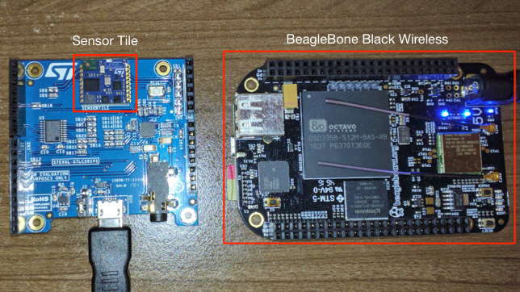
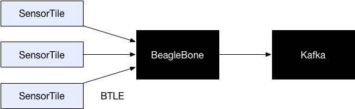

# SensorTile Kafka

ST Micro released a small IoT sensor called SensorTile. It's a 13mm x 13mm square that contains a number of sensors (e.g. temperature, air pressure, accelerometer, magnetometer, gyroscope, etc). The SensorTile communicates via BlueTooth Low Energy (BTLE).

To collect data from the SensorTile, I used a BeagleBone Black Wireless as a hub because it's relatively cheap, and can talk to BlueTooth Low Energy devices.

The Python script in this project, `sensortile_kafka.py`, runs on the BeagleBone, connects to one or more SensorTile sensors, and publishes the readings to a Kafka topic. 

An example pressure reading:

    {
        "device_name": "BM2V220",
        "device_addr": "c0:7a:4c:31:45:48",
        "timestamp": 1524979531.0,
        "type": "Pressure",
        "Pressure": 834.03

    }

An example temperature reading:

    {
        "device_name": "BM2V220",
        "device_addr": "c0:7a:4c:31:45:48",
        "timestamp": 1524980002.0,
        "type": "Temperature",
        "Temperature": 26.1
    }

I wrote this as an IoT data source for a proof of concept. 